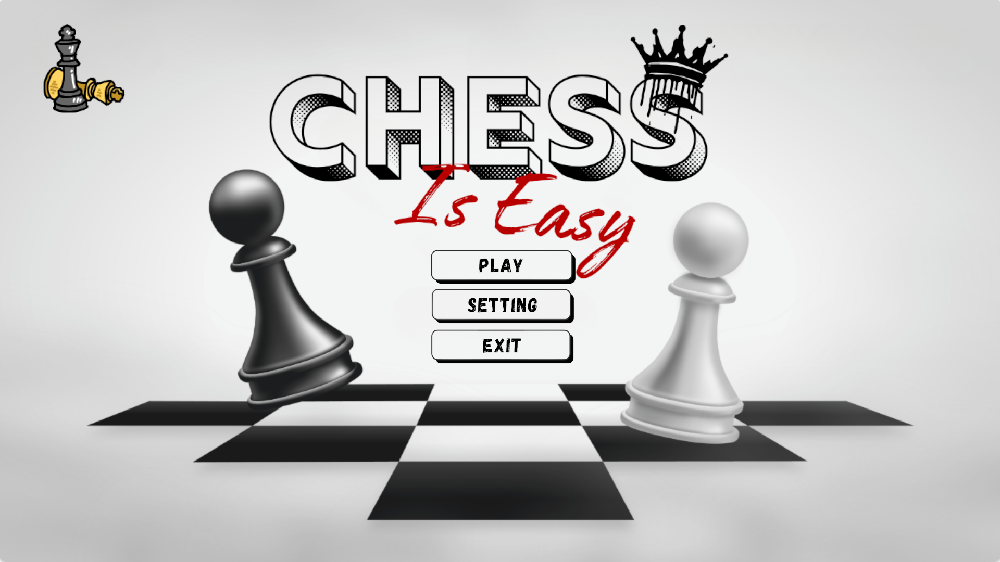
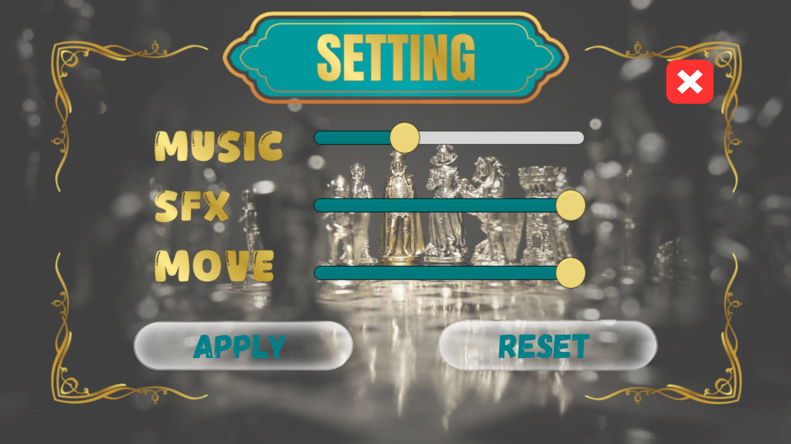
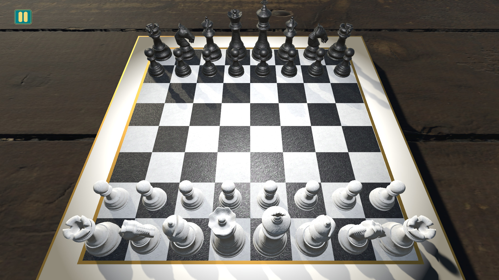
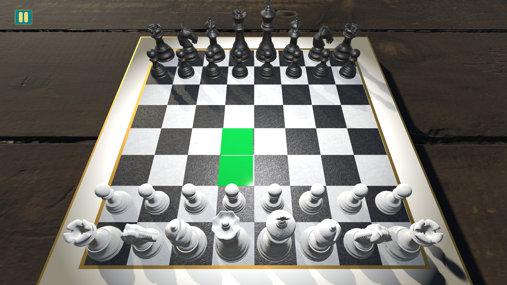
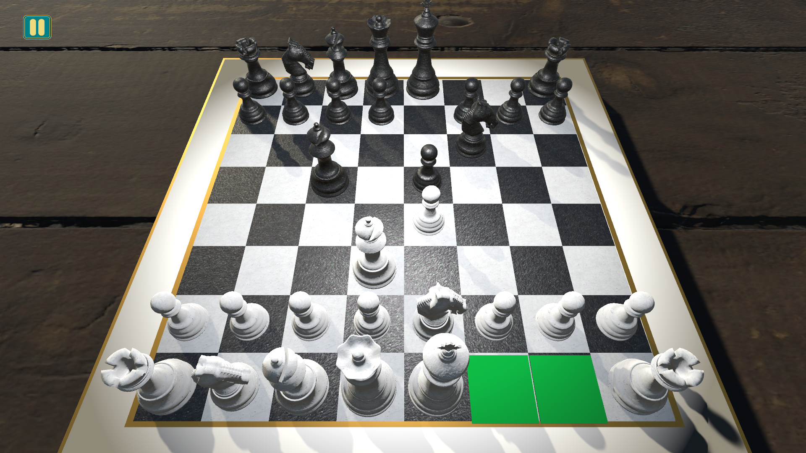
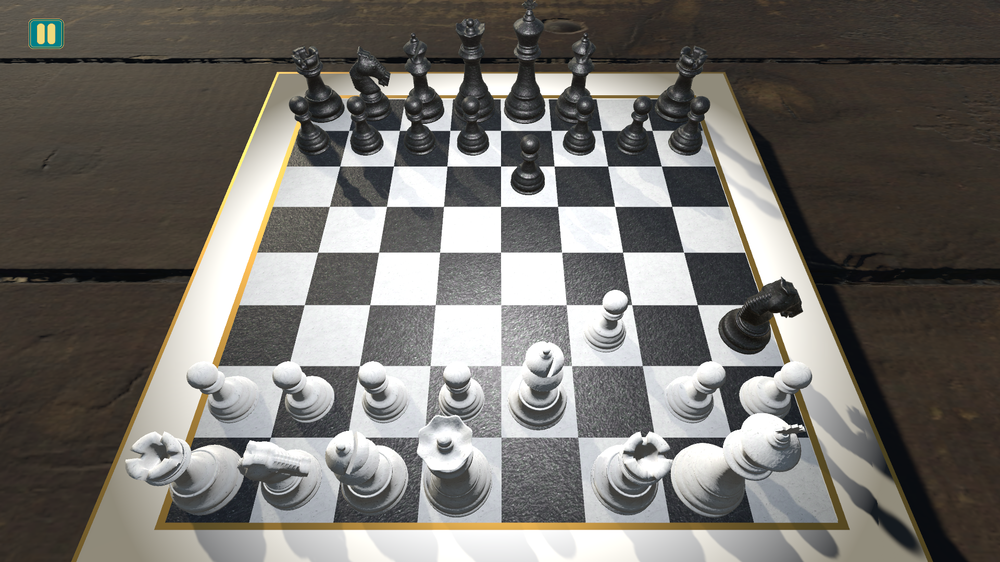
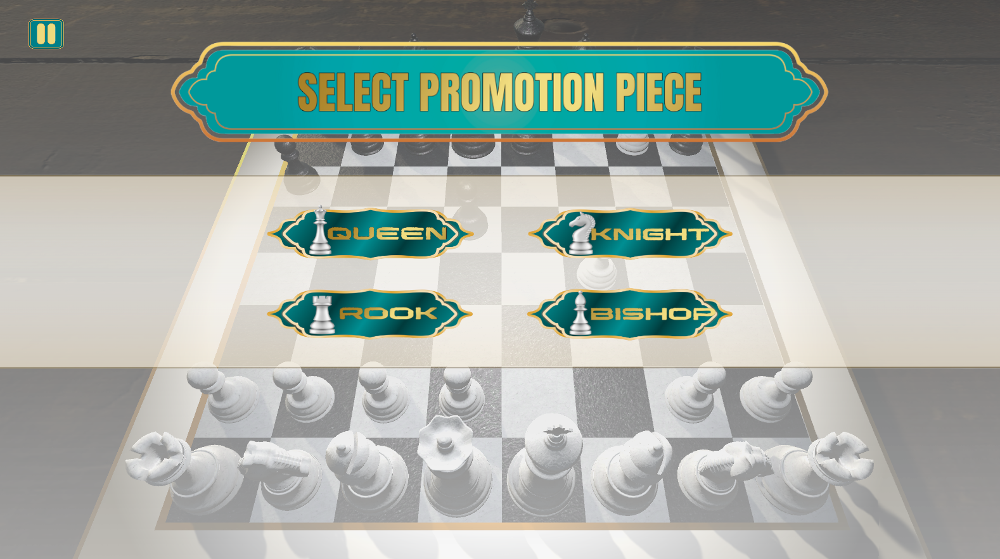
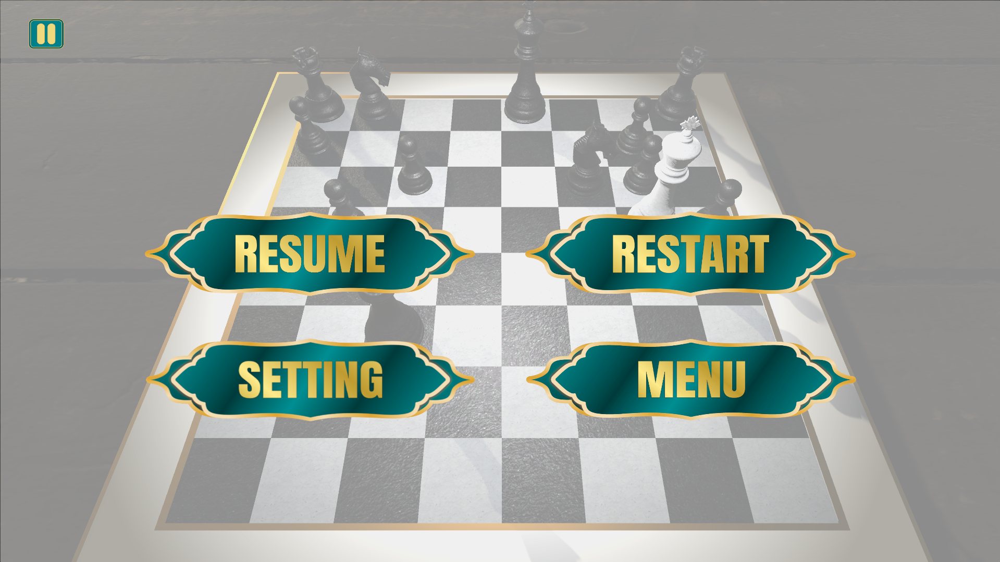
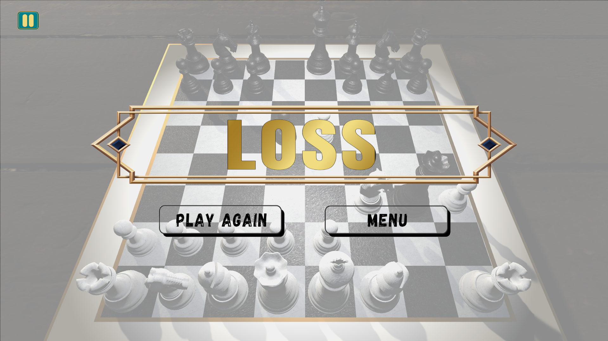

# CHESSISEASY
**ChessIsEasy** là một trò chơi **cờ vua 3D offline** được phát triển với **Unity (Front-end)** và **Spring Boot (Back-end)**.  
Dự án được chia thành hai phần chính:

- **Front-end (Unity)** - Giao diện người chơi, cài đặt âm thanh, xử lí gửi và nhận nước đi, giao tiếp với back-end. 
- **Back-end (Java Spring Boot)** - Quản lí bàn cờ, xử lí luật cờ, logic bàn cờ, nước đi hợp lệ và gửi.


---
## I. Demo:
[Link bản demo tại mục releases](https://github.com/lilquyen/ChessIsEasy/releases/tag/ChessGame1.2)
---
###  Cách chạy demo
1. Tải file `.zip` từ link trên.
2. Giải nén thư mục.
3. Chạy file `run_server.bat` để khởi động back-end.
4. Mở project Unity và chạy game.
## II. Cấu trúc dự án

```bash
ChessIsEasy/
├──back-end/
│  ├──.mvn
│  ├──src
│  ├──main
│  │  ├──java
│  │  │  ├──config
│  │  │  ├──controler
│  │  │  ├──DataTranferObject
│  │  │  ├──Models
│  │  │  ├──responsitory
│  │  │  ├──service
│  │  │  ├──ChessSeverApplication.java
│  │  │  └──resource
│  │  └──test
│  ├──target
│  ├──mvnw.cmd
│  └──pom.xml
└──front-end
   ├──_Recovery
   ├──Models
   │  ├──ChessSet
   │  └──WoodenTable
   ├──Plugins
   ├──Prefabs
   ├──Scenes
   │  ├──MainMenu
   │  └──GameScene
   ├──Scripts
   │  ├──API
   │  ├──Board
   │  ├──Data
   │  ├──Managers
   │  └──UI
   ├──Sounds
   ├──StreamingAssets
   └──TextMeshPro
```

## III. Công nghệ ứng dụng
- **Front-end:**
  • Unity  
  • C#

- **Back-end:**
  • Java  
  • Spring Boot
## IV. Các chức năng chính
- Thi đấu offline với bot.
- Sử dụng thuật toán minimax có cắt tỉa alpha-beta để ra quyết định cho bot.
- Đầy đủ các nước đi đặc biệt: Nhập thành, phong tốt, en passant.
- Logic xử lí vua bị chiếu, chiếu hết, hòa cờ.
- Hệ thống âm thanh.
- Hệ thống cài đặt.
## V. Ảnh demo
Dưới đây là một số hình ảnh trong game:
- Giao diện bắt đầu
  
- Giao diện cài đặt
  
- Giao diện khi bắt đầu ván chơi
  
- Giao diện highlight nước đi hợp lệ
  
- Nước đi nhập thành
  + Trước khi nhập thành
  
  + Sau khi nhập thành
  
- Giao diện phong tốt
  
- Giao diện pause trong trận
   
- Giao diện khi thua
  
- Giao diện khi thắng
  
## VI. Các vấn đề gặp phải
### 1. Giao tiếp giữa back-end và front-end.
**Cách giải quyết:** Sử dụng Spring Boot, front-end gửi request cho back-end và nhận lại file json chứa những thông tin cần thiết bao gồm game state hiện tại, các nước đi hiện tại, thông tin các nước đi hợp lệ
### 2. Trong một số trường hợp, AI mất nhiều thời gian để chọn ra nước đi tốt nhất.
**Cách giải quyết:** Tối ưu lại thuật toán, để tránh những trường hợp quá lâu thì giới hạn lại thời thời gian tìm nước đi.
## VII. Định hướng tiếp theo
- Cải thiện lại thuật toán
- Phân các mức độ khó dễ để người chơi có thể lựa chọn
- Thêm tính năng đăng nhập
- Thêm tính năng chơi online, tạo phòng chơi cùng bạn bè 
